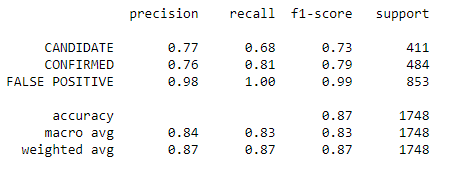

# Machine Learning Homework - Exoplanet Exploration

## Background

Over a period of nine years in deep space, the NASA Kepler space telescope has been out on a planet-hunting mission to discover hidden planets outside of our solar system.

To help process this data, this project will create machine learning models capable of classifying candidate exoplanets from the raw dataset.

This assignment will:

1. Preprocess the raw data
2. Tune the models using GridSearchCV
3. Compare two models

- - -

### Models

* Logistic Regression
* Random Forest Classifier

### Comparison

#### Logistic Regression

|           |Accuracy  |
|-----------|----------|
|Base Model |	84.325%|
|Tuned Model|	87.185%|

#### Random Forest Classifier

